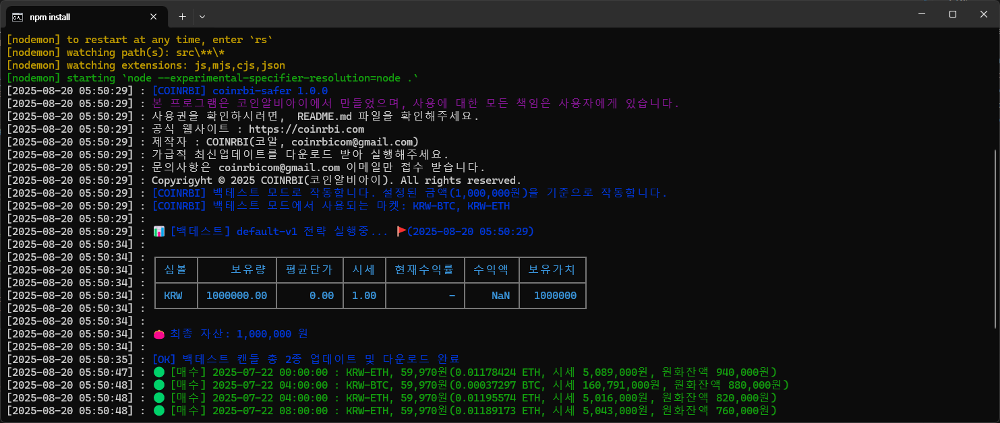

# COINRBI-SAFER



## 카피라이트

본 코드는 코인알비아이에서 만들었으며, 사용에 대한 모든 책임은 사용자에게 있습니다.

코인알비아이는 매수, 매도에 대한 책임이 없으며 사용자의 사용에 책임이 존재 합니다. 동의하지 않는다면, 사용하지 말아주십시요.

- 개인의 학습이나 개인용의 사용은 가능하지만 배포 또는 제3자 수정 및 재배포, 서비스활용 등 불허 합니다.
- 코드와 소스의 무결성을 위해 가급적 공식웹사이트에서 예제를 다운로드 받아주세요.
- 자신의 포트폴리오나 블로그 게재 등과 같이 연구 자료를 배포하는데 있어서 반드시 코인알비아이 출처를 밝혀주세요.

Copyright all Coinrbi Reversed, Since 2025

## 설명

간단한 매수/매도봇 만들기 학습을 위한 자료, 매수매도봇을 구성하고 만들어 써보기 위해서 만든 간단 스크립트 예제입니다.

## 안내

1. 베타버전에서는 백테스트모드만 현재 구현이 완료된 상태입니다. 실라이브 모드는 현재 테스트/구현중에 있습니다.

## 환경

- 버전 : 1.0.0 (베타)
- 제작일 : 2025.08.13
- 윈도우 환경에서 작동하는 간단한 봇

## 설정법

초기 세팅시 백테스팅 모드가 기본으로 켜져있습니다.

1. 프로젝트 폴더에 `.env`에 실매매를 위한 API를 입력해주어야 합니다. (백테스팅만 사용시, 기재 안하셔도 됩니다.)
2. `src/strategy/default-v1/settings.js` 파일에서는 전략설정을 할 수 있습니다.
3. `config.js` 파일에서는 백테스트 및 환경설정을 할 수 있습니다.
4. 최상위에 있는 `start.cmd` 파일을 실행하시면 프로그램이 시작 됩니다.

## 실행 방법

```bash
git clone https://github.com/coinrbicom/coinrbi-safer.git
cd coinrbi-safer
npm install
npm run dev
```

윈도우 환경에서는 `start.cmd` 실행시 `nodemon`이 작동하여 스크립트에 인수 또는 변경시 바로 실시간 반영됩니다.

## 모드지원

1. 백테스트모드 : 과거 차트를 기준으로 인디케이터 옵션을 주고, 시스템 매매를 진행하는 것을 테스트 합니다.
2. 라이브모드 : 설정된 인디케이터 값 기준으로 매매를 진행합니다.

## 라이브모드에서의 주의사항

매매를 진행하게 되면, 원화장 전체를 기반으로 매매를 진행하게 됩니다. 따라서 충분한 시드가 필요합니다.
설정된 매수, 매도가 올바르지 않다면 진행이 어려울 수 있습니다.
라이브모드를 진행하게되면 설정된 `인터벌 + 감시가격`이 중요해집니다.

1) 감시가격 : 종가(trade_price) 또는 시가(openning_price)를 반드시 지정해주세요.
2) 인터벌 : 1 ~ 주봉까지 지원하며, 인터벌 값에 따라서 매매를 진행하게 됩니다.

 * `감시가의 역할` : 인디케이터와 매수/매도의 판정가격을 의미하며
실제 매수가 진행되는 가격은 시장가매수로 `trade_price`로 진행됩니다. 

[매수관여] 시간
시가 + 인터벌 15분이라면 매매시간은 58분 ~ 03분까지 진행됩니다.
종가 + 인터벌 15분이라면 매매시간은 12분 ~ 16분 사이로 진행 됩니다.

매도에는 시간은 관여하지 않도록 구성했지만, 수정을 통해서 바꿀 수 있습니다. 

- 소스위치 : `src\strategies\default-v1\index.js`

* 업비트의 캔들 생성시간이 정확하게 종각 시간에 발행이 안되는 점
* 자동매매봇이 전체 원화장을 순회하는 시간
* 업비트 API의 호출제한량의 간격 및 분당 호출 제한량에 제약이 있다는 점
* 원화장이 100종 이상이라는 점

이점에 있어서 오차가 반영되었다 볼 수 있습니다.

## 실 API키 연동시 주의사항

`src` 폴더 안에 `config.js` 폴더에 설정만 기입하시거나 `.env` 파일을 만들어서 넣어주세요.

`.env.example`은 예시 입니다. 파일명을 고쳐서 `.env`로 바꾸어서 쓰셔도 됩니다.

- API키와 API시크릿을 업데이트 해야 합니다.
- ⚠️ 안전을 위해 가급적 매매관련 구간만 허용하여 발급받아주세요. (입출금 기능은 체크하지 않고 받기)
- 발급안내 : https://upbit.com/service_center/open_api_guide
- 업비트 개발자센터 : https://docs.upbit.com/kr

## 주요 구성된 내용

`src` : 소스폴더
  strategies : 매수 또는 매도 전략 처리 구문을 담은 소스
  actions : 봇의 기능 작동을 위한 처리 구문을 담은 소스
  inspects : 봇의 구간적 유닛 점검을 위한 디버깅 소스

## 제작자 및 정보 공유

- 제작자 : 코인알비아이(코알)
- 문의 : coinrbicom@gmail.com
- 웹 : https://coinrbi.com
- 대화방 : https://open.kakao.com/o/gLZuhJzd
